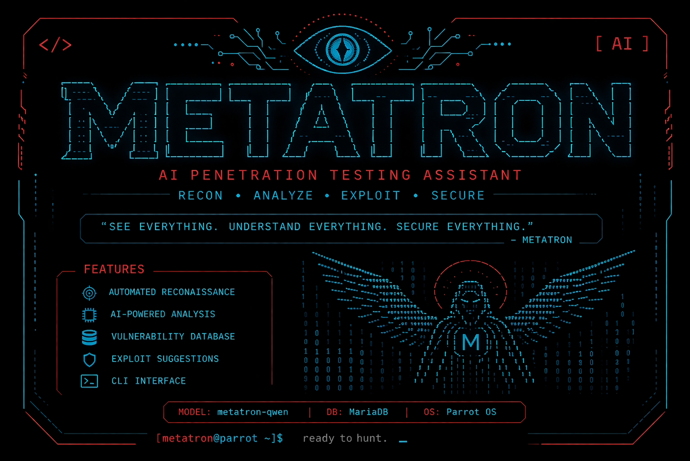
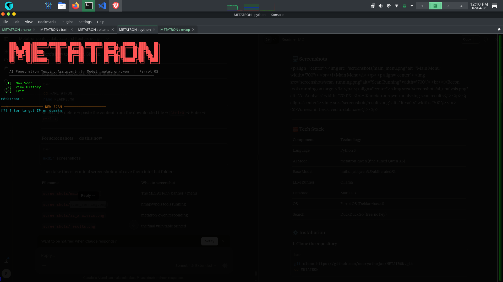
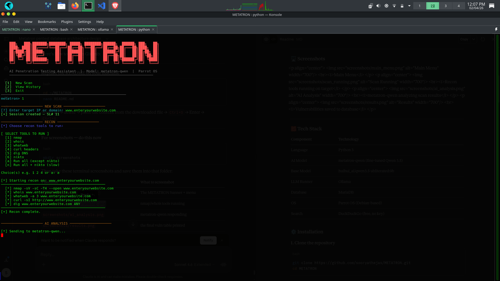
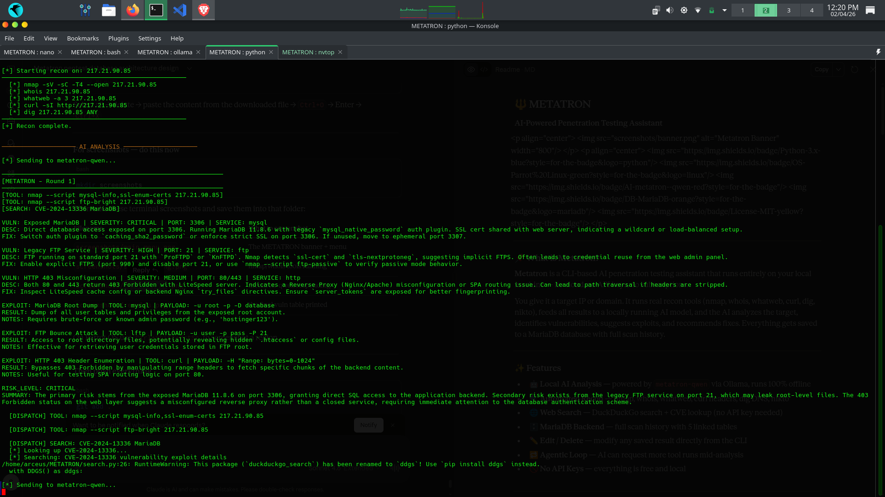
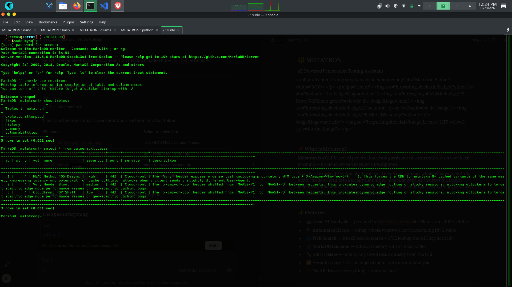

# METATRON
AI-powered penetration testing assistant using local LLMs on Linux
# METATRON
### AI-Powered Penetration Testing Assistant

<p align="center">
  
</p>

<p align="center">
  
  
  
  
  
</p>

---

## What is Metatron?

**Metatron** is a CLI-based AI penetration testing assistant that runs entirely on your local machine — no cloud, no API keys, no subscriptions.

You give it a target IP or domain. It runs real recon tools (nmap, whois, whatweb, curl, dig, nikto), feeds all results to a locally running AI model, and the AI analyzes the target, identifies vulnerabilities, suggests exploits, and recommends fixes. Everything gets saved to a MariaDB database with full scan history.

---

## Features

- **Local AI Analysis** — powered by Qwen 3.5 abliterated models via Ollama or LM Studio, runs 100% offline
- **Automated Recon** — nmap, whois, whatweb, curl headers, dig DNS, nikto
- **Web Search** — DuckDuckGo search + CVE lookup (no API key needed)
- **MariaDB Backend** — full scan history with 6 linked tables
- **Edit / Delete** — modify any saved result directly from the CLI
- **Agentic Loop** — AI can request more tool runs mid-analysis
- **Self-Review Pass** — automatic second-pass audit catches hallucinations before saving
- **Corrections & Hallucination Tracking** — record what the AI got right and wrong per finding
- **Training Data Export** — export corrected sessions as JSONL for fine-tuning
- **Export Reports** — PDF and HTML vulnerability reports
- **No API Keys** — everything is free and local

---

## Screenshots

<p align="center">
  
  <br><i>Main Menu</i>
</p>

<p align="center">
  
  <br><i>Recon tools running on target</i>
</p>

<p align="center">
  
  <br><i>AI analyzing scan results</i>
</p>

<p align="center">
  
  <br><i>Vulnerabilities saved to database</i>
</p>

<p align="center">
  
  <br><i>Export scan results as PDF and/or HTML</i>
</p>

---

## Tech Stack

| Component  | Technology                                          |
|------------|-----------------------------------------------------|
| Language   | Python 3                                            |
| AI Models  | `huihui_ai/qwen3.5-abliterated` (9B or 27B)        |
| LLM Runner | Ollama **or** LM Studio (OpenAI-compatible API)     |
| Database   | MariaDB                                             |
| OS         | Kali Linux / Parrot OS (Debian-based)               |
| Search     | DuckDuckGo (free, no key)                           |

---

## Installation

### 1. Clone the repository

```bash
git clone https://github.com/sooryathejas/METATRON.git
cd METATRON
```

### 2. Create and activate virtual environment

```bash
python3 -m venv venv
source venv/bin/activate
```

### 3. Install Python dependencies

```bash
pip install -r requirements.txt
```

### 4. Install system tools

```bash
sudo apt install nmap whois whatweb curl dnsutils nikto
```

---

## AI Model Setup

Metatron supports two local LLM backends. Choose one:

### Option A — Ollama

#### Step 1 — Install Ollama

```bash
curl -fsSL https://ollama.com/install.sh | sh
```

#### Step 2 — Download the base model

```bash
ollama pull huihui_ai/qwen3.5-abliterated:9b
```

> If your system has less than 8.4 GB RAM, use the 4b variant:
> ```bash
> ollama pull huihui_ai/qwen3.5-abliterated:4b
> ```
> Then edit `Modelfile` and change the FROM line to the 4b model.

#### Step 3 — Build the custom metatron-qwen model

The repo includes a `Modelfile` that configures the model with pentest-specific parameters:

```bash
ollama create metatron-qwen -f Modelfile
```

This creates your local `metatron-qwen` model with:
- 16,384 token context window
- Temperature: 0.7
- Top-k: 10
- Top-p: 0.9

#### Step 4 — Verify

```bash
ollama list
```

You should see `metatron-qwen` in the list.

### Option B — LM Studio

#### Step 1 — Install LM Studio

Download from [lmstudio.ai](https://lmstudio.ai) and install.

#### Step 2 — Load a model

In LM Studio, search for and download a Qwen 3.5 abliterated model. Recommended:
- `huihui-ai/huihui-qwen3.5-27b-abliterated` (27B — better analysis quality, needs ~20GB RAM)
- `huihui-ai/huihui-qwen3.5-9b-abliterated` (9B — lighter, needs ~8GB RAM)

#### Step 3 — Start the local server

In LM Studio, go to the Local Server tab and start the server. It runs on `http://localhost:1234` by default.

#### Step 4 — Configure Metatron

Create a `.env` file in the project root (copy from `.env.example`):

```bash
METATRON_LLM_URL=http://localhost:1234
METATRON_MODEL=huihui-ai.huihui-qwen3.5-27b-abliterated
```

Or for Ollama (default port 11434):
```bash
METATRON_LLM_URL=http://localhost:11434
METATRON_MODEL=metatron-qwen
```

### LLM Parameters

These parameters are used for all AI calls and can be overridden via environment variables:

| Parameter     | Default | Env Variable          | Notes                                      |
|---------------|---------|------------------------|---------------------------------------------|
| Temperature   | 0.7     | (hardcoded in llm.py)  | Matches Modelfile                           |
| Top-k         | 10      | `METATRON_TOP_K`       | Matches Modelfile                           |
| Top-p         | 0.9     | (hardcoded in llm.py)  | Matches Modelfile                           |
| Max tokens    | 8192    | `METATRON_MAX_TOKENS`  | Max response length                         |
| Context window| 16384   | Set at model load time | Configure in Ollama Modelfile or LM Studio  |
| Timeout       | 600s    | `METATRON_TIMEOUT`     | Per-request timeout                         |
| Tool loops    | 9       | `METATRON_MAX_LOOPS`   | Max agentic tool dispatch rounds            |

---

## Database Setup

### Step 1 — Make sure MariaDB is running

```bash
sudo systemctl start mariadb
sudo systemctl enable mariadb
```

### Step 2 — Create the database and user

```bash
mysql -u root
```

```sql
CREATE DATABASE metatron;
CREATE USER 'metatron'@'localhost' IDENTIFIED BY '123';
GRANT ALL PRIVILEGES ON metatron.* TO 'metatron'@'localhost';
FLUSH PRIVILEGES;
EXIT;
```

### Step 3 — Create the tables

```bash
mysql -u metatron -p123 metatron
```

```sql
CREATE TABLE history (
  sl_no     INT AUTO_INCREMENT PRIMARY KEY,
  target    VARCHAR(255) NOT NULL,
  scan_date DATETIME NOT NULL,
  status    VARCHAR(50) DEFAULT 'active'
);

CREATE TABLE vulnerabilities (
  id          INT AUTO_INCREMENT PRIMARY KEY,
  sl_no       INT,
  vuln_name   TEXT,
  severity    VARCHAR(50),
  port        VARCHAR(20),
  service     VARCHAR(100),
  description TEXT,
  FOREIGN KEY (sl_no) REFERENCES history(sl_no)
);

CREATE TABLE fixes (
  id       INT AUTO_INCREMENT PRIMARY KEY,
  sl_no    INT,
  vuln_id  INT,
  fix_text TEXT,
  source   VARCHAR(50),
  FOREIGN KEY (sl_no) REFERENCES history(sl_no),
  FOREIGN KEY (vuln_id) REFERENCES vulnerabilities(id)
);

CREATE TABLE exploits_attempted (
  id           INT AUTO_INCREMENT PRIMARY KEY,
  sl_no        INT,
  exploit_name TEXT,
  tool_used    TEXT,
  payload      LONGTEXT,
  result       TEXT,
  notes        TEXT,
  FOREIGN KEY (sl_no) REFERENCES history(sl_no)
);

CREATE TABLE summary (
  id           INT AUTO_INCREMENT PRIMARY KEY,
  sl_no        INT,
  raw_scan     LONGTEXT,
  ai_analysis  LONGTEXT,
  risk_level   VARCHAR(50),
  generated_at DATETIME,
  FOREIGN KEY (sl_no) REFERENCES history(sl_no)
);

CREATE TABLE corrections (
  id             INT AUTO_INCREMENT PRIMARY KEY,
  sl_no          INT NOT NULL,
  vuln_id        INT NOT NULL,
  status         VARCHAR(50) NOT NULL COMMENT 'hallucination, corrected, verified, downgraded, reclassified',
  original_text  TEXT,
  corrected_text TEXT,
  reason         TEXT,
  corrected_at   DATETIME NOT NULL,
  FOREIGN KEY (sl_no)   REFERENCES history(sl_no),
  FOREIGN KEY (vuln_id) REFERENCES vulnerabilities(id)
);

CREATE TABLE evaluations (
  id               INT AUTO_INCREMENT PRIMARY KEY,
  sl_no            INT NOT NULL,
  vuln_id          INT NOT NULL,
  evaluator        VARCHAR(100) NOT NULL COMMENT 'e.g., claude-opus-4-6, gpt-5-4, human',
  evidence_cited   TEXT,
  verdict          VARCHAR(50) NOT NULL COMMENT 'valid, hallucination, corrected, downgraded, reclassified',
  confidence       VARCHAR(20) DEFAULT 'medium' COMMENT 'high, medium, low',
  severity_correct BOOLEAN DEFAULT FALSE,
  cve_correct      BOOLEAN DEFAULT FALSE,
  software_correct BOOLEAN DEFAULT FALSE,
  fix_correct      BOOLEAN DEFAULT FALSE,
  notes            TEXT,
  evaluated_at     DATETIME NOT NULL,
  FOREIGN KEY (sl_no)   REFERENCES history(sl_no),
  FOREIGN KEY (vuln_id) REFERENCES vulnerabilities(id)
);
```

---

## Usage

Metatron needs **two terminal tabs** to run.

### Terminal 1 — Load the AI model

**Ollama:**
```bash
ollama run metatron-qwen
```

**LM Studio:**
Start the local server from the LM Studio UI (Local Server tab).

Wait until the model is loaded and ready.

### Terminal 2 — Launch Metatron

```bash
cd ~/METATRON
source venv/bin/activate
python metatron.py
```

---

### Walkthrough

**1. Main menu appears:**
```
  [1]  New Scan
  [2]  View History
  [3]  Export Eval Package
  [4]  Import Evaluation
  [5]  Export Training Data
  [6]  Exit
```

**2. Select [1] New Scan — enter your target:**
```
[?] Enter target IP or domain: 192.168.1.1
```
or
```
[?] Enter target IP or domain: example.com
```

**3. Select recon tools to run:**
```
  [1] nmap
  [2] whois
  [3] whatweb
  [4] curl headers
  [5] dig DNS
  [6] nikto
  [a] Run all (except nikto)
  [n] Run all + nikto (slow)
```

**4. Metatron runs the tools, feeds results to the AI, and prints the analysis.**

**5. The AI self-review pass automatically audits the findings for hallucinations.**

**6. Everything is saved to MariaDB automatically.**

**7. After the scan you can edit/delete results or add correction records.**

**8. Select [3] Export Eval Package to generate a review file for an external LLM.**

**9. Select [4] Import Evaluation to paste back the external LLM's review.**

**10. Select [5] Export Training Data to export corrected sessions as JSONL for fine-tuning.**

---

## Corrections & Feedback Loop

Metatron includes a built-in system for tracking AI accuracy and improving future results:

**Correction statuses:**
- `hallucination` — fabricated finding with no scan evidence
- `corrected` — finding exists but details were wrong (e.g., wrong CVE)
- `verified` — finding confirmed as accurate
- `downgraded` — severity was inflated without evidence
- `reclassified` — not a vulnerability, reclassified as recommendation

**How it works:**
1. After each scan, a self-review pass cross-checks every finding against the raw scan data
2. Flagged findings are automatically saved as corrections (with evidence and reasoning preserved)
3. You can manually add/edit corrections via the edit/delete menu
4. On every future scan, past corrections are injected into the system prompt as learned rules
5. Export corrected sessions as JSONL training data for model fine-tuning

This creates a feedback loop where every correction makes future scans more accurate.

---

## LLM Evaluation Workflow

Metatron supports structured external evaluation of AI findings using any LLM (Claude, GPT, etc.):

**1. Export an eval package:**
```
metatron> 3
Enter SL# to export: 3
[+] Eval package ready: evals/eval_SL3_www_mankelumber_com_20260415.md
```

The package contains: raw scan data, all AI findings, existing corrections, and a structured evaluation rubric.

**2. Review with an external LLM:**

Paste the eval package contents into Claude Code (or any LLM). The rubric instructs the reviewer to score each finding on:
- Evidence basis (is there scan data supporting this?)
- CVE accuracy (are cited CVEs correct for the detected version?)
- Severity justification (is the severity level evidence-based?)
- Software identification (is the software correctly identified?)
- Fix quality (is the recommended fix actionable?)

Each finding gets a verdict with a confidence level (high/medium/low).

**3. Import the evaluation:**
```
metatron> 4
Enter SL# this evaluation is for: 3
Evaluator name: claude-opus-4-6
<paste the response, then type END>
```

Evaluations are stored in the `evaluations` table with per-field accuracy tracking, enabling metrics like:
- Hallucination rate per model
- CVE accuracy rate
- Severity estimation accuracy
- Per-evaluator agreement

---

## Project Structure

```
METATRON/
├── metatron.py       <- main CLI entry point
├── db.py             <- MariaDB connection, CRUD, eval export/import
├── tools.py          <- recon tool runners (nmap, whois, etc.)
├── llm.py            <- LLM interface, self-review, and AI tool dispatch loop
├── search.py         <- DuckDuckGo web search and CVE lookup
├── export.py         <- PDF and HTML report generation
├── config.py         <- centralized configuration (LLM, DB, parameters)
├── Modelfile         <- Ollama model config for metatron-qwen
├── requirements.txt  <- Python dependencies
├── .env.example      <- example environment config
├── .gitignore        <- excludes venv, pycache, reports, training, evals
├── LICENSE           <- MIT License
├── README.md         <- this file
├── migrations/       <- SQL migration scripts for DB schema changes
├── screenshots/      <- terminal screenshots for documentation
├── training/         <- exported JSONL training data (gitignored)
└── evals/            <- exported eval packages for external review (gitignored)
```

---

## Database Schema

All 7 tables are linked by `sl_no` (session number) from the `history` table:

```
history                  <- one row per scan session (sl_no is the spine)
    |
    |-- vulnerabilities      <- vulns found, linked by sl_no
    |       |
    |       |-- fixes        <- fixes per vuln, linked by vuln_id + sl_no
    |       |
    |       |-- corrections  <- accuracy records per vuln (hallucination/corrected/verified)
    |       |
    |       |-- evaluations  <- external LLM review scores per vuln (per-field accuracy)
    |
    |-- exploits_attempted   <- exploits tried, linked by sl_no
    |
    |-- summary              <- raw scan data + AI analysis + model_name, linked by sl_no
```

---

## Disclaimer

This tool is intended for **educational purposes and authorized penetration testing only**.

- Only use Metatron on systems you own or have **explicit written permission** to test.
- Unauthorized scanning or exploitation of systems is **illegal**.
- The author is not responsible for any misuse of this tool.

---

## Author

**Soorya Thejas**
- GitHub: [@sooryathejas](https://github.com/sooryathejas)

---

## License

This project is licensed under the MIT License — see the [LICENSE](LICENSE) file for details.
